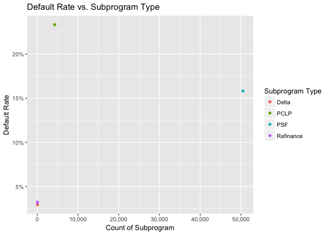
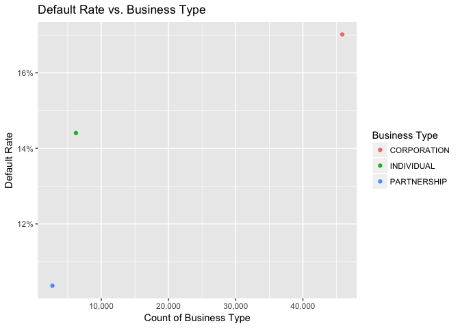
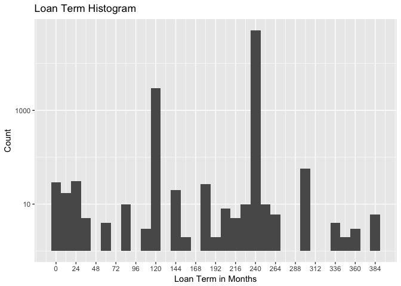
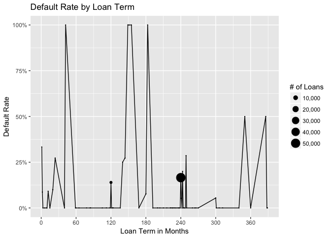
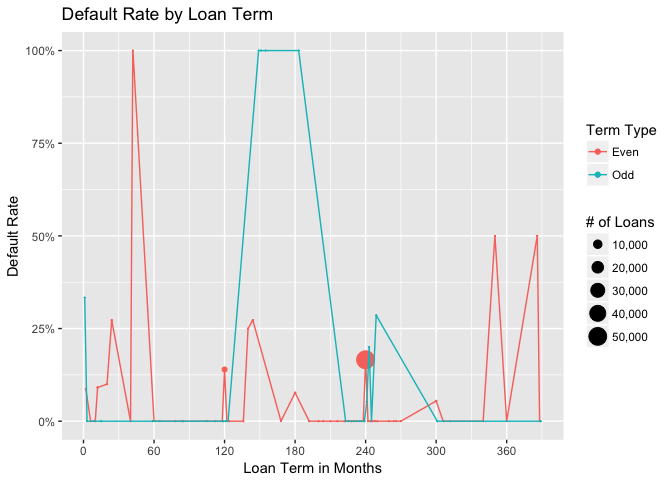
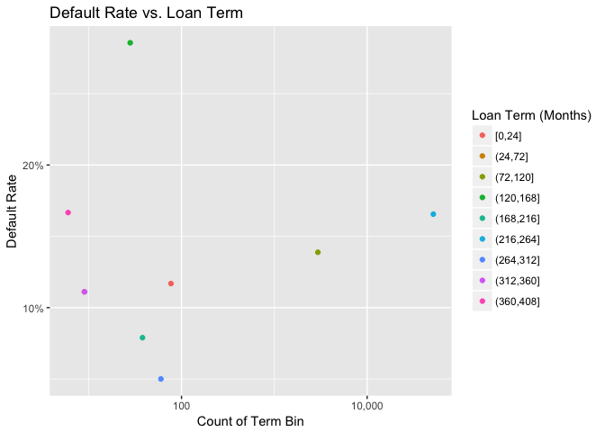
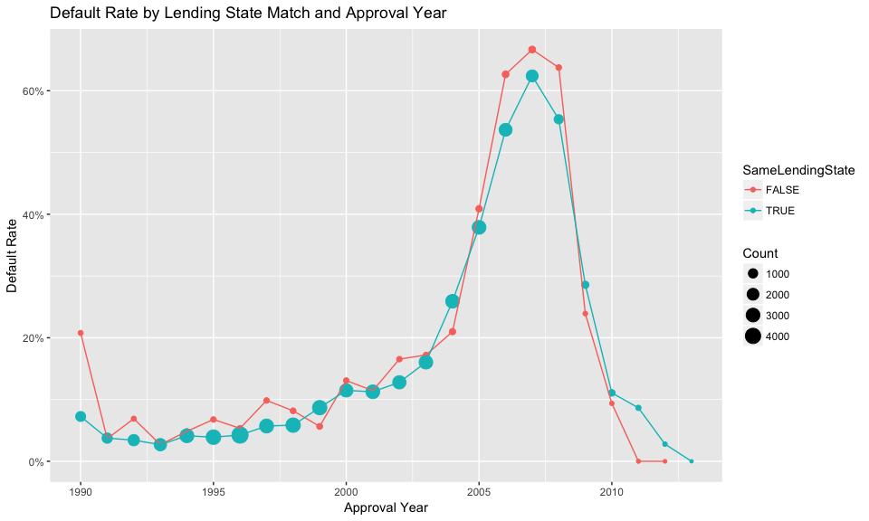
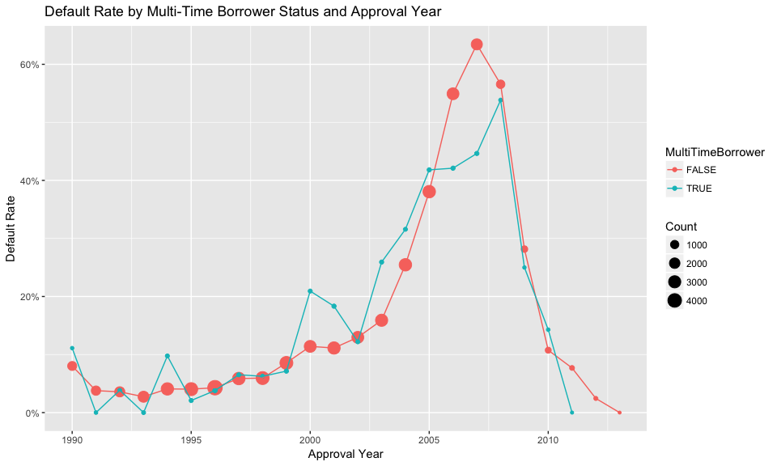

MSE 246 Data Summary
================
Samuel Hansen
1/16/2017

-   [Fraction of Defaulted Loans](#fraction-of-defaulted-loans)
-   [NAICS Code](#naics-code)
    -   [Default Rate by NAICS Code](#default-rate-by-naics-code)
-   [Loan Amount](#loan-amount)
    -   [Loan Amount Histogram](#loan-amount-histogram)
    -   [Default Rate by Loan Amount](#default-rate-by-loan-amount)
-   [Subprogram Description](#subprogram-description)
    -   [Default Rate vs. Subprogram Description](#default-rate-vs.-subprogram-description)
-   [Business Type](#business-type)
    -   [Default Rate vs. Business Type](#default-rate-vs.-business-type)
    -   [Default Rate vs. Business Type by Approval Year](#default-rate-vs.-business-type-by-approval-year)
-   [Loan Term](#loan-term)
    -   [Load Term Histogram](#load-term-histogram)
    -   [Default Rate by Loan Term](#default-rate-by-loan-term)
    -   [Default Rate by Loan Term and Divisibility](#default-rate-by-loan-term-and-divisibility)
    -   [Default Rate vs. Load Term by Approval Year](#default-rate-vs.-load-term-by-approval-year)
-   [Matching Lending State](#matching-lending-state)
    -   [Default Rate vs. Matching Lending State by Approval Year](#default-rate-vs.-matching-lending-state-by-approval-year)
-   [Multi-Time Borrower](#multi-time-borrower)
    -   [Default Rate vs. Multi-Time Borrower Status by Approval Year](#default-rate-vs.-multi-time-borrower-status-by-approval-year)

``` r
# Initialize libraries and input files 
library(ggrepel)
library(knitr)
library(lubridate)
library(tidyverse)
file_in <- "../data/SBA_Loan_data_1.csv"
```

``` r
# Read in data 
df <- 
  read_csv(file_in) %>%
  plyr::rename(replace = c("2DigitNAICS" = "NAICS")) %>%
  mutate(ApprovalDate = mdy(ApprovalDate))
```

Fraction of Defaulted Loans
===========================

``` r
kable(
  df %>%
  count(LoanStatus) %>%
  mutate(proportion = n/sum(n))
)
```

| LoanStatus |      n|  proportion|
|:-----------|------:|-----------:|
| CHGOFF     |   8982|   0.1638872|
| PIF        |  45824|   0.8361128|

NAICS Code
==========

Default Rate by NAICS Code
--------------------------

``` r
df %>%
  filter(NAICS != "00") %>%
  group_by(NAICS, year = year(ApprovalDate)) %>%
  summarise(default_rate = mean(LoanStatus == "CHGOFF")) %>%
  ggplot(mapping = aes(x = year, y = default_rate, color = NAICS)) +
  geom_point() +
  geom_line() +
  scale_y_continuous(labels = scales::percent) +
  labs(x = "Approval Year", y = "Default Rate", title = "Default Rate by NAICS Code")
```


Loan Amount
===========

Loan Amount Histogram
---------------------

``` r
df %>%
  ggplot(mapping = aes(x = GrossApproval)) +
  geom_histogram(binwidth = 10000) +
  scale_x_continuous(labels = scales::dollar, limits = c(0,2000000)) +
  labs(x = "Gross Approval Amount", y = "Count",
       title = "Loan Gross Approval Histogram")
```


Default Rate by Loan Amount
---------------------------

``` r
loan_labels <- c("(-10,1e+05]" = "< 100k",
                 "(1e+05,3e+05]" = "100k - 300k",
                 "(3e+05,5e+05]" = "300k - 500k",
                 "(5e+05,1e+06]" = "500k - 1m",
                 "(1e+06,2e+06]" = "1m - 2m",
                 "(2e+06,4e+06]" = "> 2m")
df %>%
  mutate(#loan_bin = cut_width(GrossApproval, width = 1000000),
         loan_bin = cut(GrossApproval, breaks = c(-10, 100000, 300000, 
                                                  500000, 1000000,2000000, 4000000)),
         loan_bin = plyr::revalue(loan_bin, loan_labels),
         year = year(ApprovalDate)) %>%
  
  group_by(loan_bin, year) %>%
  summarise(count = n(),
            frac_defaulted = mean(LoanStatus == "CHGOFF")) %>%
  ggplot(mapping = aes(x = year, y = frac_defaulted, color = loan_bin)) +
  geom_point(mapping = aes(size = count)) +
  geom_line() +
  scale_y_continuous(labels = scales::percent) +
  scale_size_continuous(name = "Number of Loans") + 
  scale_color_discrete(name = "Loan Amount ($)") + 
  labs(x = "Approval Year", y = "Default Rate", title = "Default Rate by Loan Amount")
```


Subprogram Description
======================

Default Rate vs. Subprogram Description
---------------------------------------

Subprogram description is the specific subprogram that the loan was approved under. See SOP 50 10 5 for definitions and rules for each subprogram.

``` r
df %>%
  group_by(subpgmdesc) %>%
  summarise(count = n(),
            frac_defaulted = mean(LoanStatus == "CHGOFF")) %>%
  ggplot(mapping = aes(x = count, y = frac_defaulted, color = subpgmdesc)) +
  geom_point() +
  scale_y_continuous(labels = scales::percent) +
  scale_x_continuous(labels = scales::comma) +
  scale_color_discrete(name = "Subprogram Type") + 
  labs(x = "Count of Subprogram", y = "Default Rate",
       title = "Default Rate vs. Subprogram Type")
```



This plot suggests we can collapse the `PSF` and `Refinance` categories into `other` because they have low counts and default rates.

Business Type
=============

Default Rate vs. Business Type
------------------------------

``` r
df %>%
  group_by(BusinessType) %>%
  summarise(count = n(),
            frac_defaulted = mean(LoanStatus == "CHGOFF")) %>%
  ggplot(mapping = aes(x = count, y = frac_defaulted, color = BusinessType)) +
  geom_point() +
  scale_y_continuous(labels = scales::percent) +
  scale_x_continuous(labels = scales::comma) +
  scale_color_discrete(name = "Business Type") + 
  labs(x = "Count of Business Type", y = "Default Rate",
       title = "Default Rate vs. Business Type")
```



Default Rate vs. Business Type by Approval Year
-----------------------------------------------

``` r
df %>%
  group_by(BusinessType, year = year(ApprovalDate)) %>%
  summarise(count = n(),
            frac_defaulted = mean(LoanStatus == "CHGOFF")) %>%
  ggplot(mapping = aes(x = year, y = frac_defaulted, color = BusinessType)) +
  geom_point(mapping = aes(size = count)) +
  geom_line() +
  scale_y_continuous(labels = scales::percent) +
  scale_size_continuous(name = "Count") +
  # scale_x_continuous(labels = scales::comma) +
  scale_color_discrete(name = "Business Type") + 
  labs(x = "Approval Year", y = "Default Rate",
       title = "Default Rate vs. Business Type by Approval Year")
```


Loan Term
=========

Load Term Histogram
-------------------

``` r
df %>%
  ggplot(mapping = aes(x = TermInMonths)) +
  geom_histogram(binwidth = 12) +
  scale_y_log10() +
  scale_x_continuous(breaks = seq(0,400,24)) +
  labs(x = "Loan Term in Months", y = "Count",
       title = "Loan Term Histogram")
```



Default Rate by Loan Term
-------------------------

``` r
df %>% 
  group_by(TermInMonths) %>%
  summarise(count = n(),
            frac_defaulted = mean(LoanStatus == "CHGOFF")) %>%
  ggplot(mapping = aes(x = TermInMonths, y = frac_defaulted)) +
  geom_point(mapping = aes(size = count)) +
  geom_line() +
  scale_y_continuous(labels = scales::percent) +
  scale_x_continuous(breaks = seq(0,400,60)) +
  labs(x = "Loan Term in Months", y = "Default Rate",
       title = "Default Rate by Loan Term") +
  scale_size_area(name = "# of Loans", labels = scales::comma)
```



Default Rate by Loan Term and Divisibility
------------------------------------------

``` r
df %>% 
  group_by(TermInMonths) %>%
  summarise(count = n(),
            frac_defaulted = mean(LoanStatus == "CHGOFF")) %>% 
  arrange(desc(frac_defaulted)) %>%
  mutate(term_divisibility = ifelse(TermInMonths %% 2 == 0, "Even", "Odd")) %>%
  ggplot(mapping = aes(x = TermInMonths, 
                       y = frac_defaulted, 
                       color = term_divisibility)) +
  geom_point(mapping = aes(size = count)) +
  geom_line() +
  scale_y_continuous(labels = scales::percent) +
  scale_x_continuous(breaks = seq(0,400,60)) +
  scale_color_discrete(name = "Term Type") +
  labs(x = "Loan Term in Months", y = "Default Rate",
       title = "Default Rate by Loan Term") +
  scale_size_area(name = "# of Loans", labels = scales::comma)
```



Default Rate vs. Load Term by Approval Year
-------------------------------------------

``` r
df %>%
  mutate(term_bin = cut_width(TermInMonths, width = 48), 
         term_bin = plyr::revalue(term_bin, 
                                  replace = c("[-24,24]" = "[0,24]"))) %>%
  group_by(term_bin) %>%
  summarise(count = n(),
            frac_defaulted = mean(LoanStatus == "CHGOFF")) %>%
  ggplot(mapping = aes(x = count, y = frac_defaulted, color = term_bin)) +
  geom_point() +
  scale_x_log10(labels = scales::comma) +
  scale_y_continuous(labels = scales::percent) +
  scale_color_discrete(name = "Loan Term (Months)") + 
  labs(x = "Count of Term Bin", y = "Default Rate",
       title = "Default Rate vs. Loan Term")
```



The bin (120,168\] has an unusually high default rate; however, it has a low count. In fact, all term bins except for (216,264\] and (72,120\] have less than 100 observations. In turn, we may consider collapsing these infrequent bins, rather than treating `Term in Months` as a continuous feature.

Matching Lending State
======================

Default Rate vs. Matching Lending State by Approval Year
--------------------------------------------------------

``` r
df %>%
  group_by(SameLendingState, year = year(ApprovalDate)) %>%
  summarise(count = n(),
            frac_defaulted = mean(LoanStatus == "CHGOFF")) %>%
  ggplot(mapping = aes(x = year, y = frac_defaulted, color = SameLendingState)) +
  geom_point(mapping = aes(size = count)) +
  geom_line() +
  scale_y_continuous(labels = scales::percent) +
  scale_size_continuous(name = "Count") + 
  labs(x = "Approval Year", y = "Default Rate", 
       title = "Default Rate by Lending State Match and Approval Year")
```



Multi-Time Borrower
===================

Default Rate vs. Multi-Time Borrower Status by Approval Year
------------------------------------------------------------

``` r
df %>%
  group_by(MultiTimeBorrower, year = year(ApprovalDate)) %>%
  summarise(count = n(),
            frac_defaulted = mean(LoanStatus == "CHGOFF")) %>%
  ggplot(mapping = aes(x = year, y = frac_defaulted, color = MultiTimeBorrower)) +
  geom_point(mapping = aes(size = count)) +
  geom_line() +
  scale_y_continuous(labels = scales::percent) +
  scale_size_continuous(name = "Count") + 
  labs(x = "Approval Year", y = "Default Rate", 
       title = "Default Rate by Multi-Time Borrower Status and Approval Year")
```



``` r
# Fraction of active loans in a given year
# number of defaulted / number of loans active in a given year 

# df2 <-
#   read_delim("../data/SBA_Loan_data.txt", delim = "\t")
# 
# df2 <-
#   df2 %>%
#   filter(LoanStatus == "CHGOFF" | LoanStatus == "PIF",
#          TermInMonths > 0,
#          ) %>%
```
