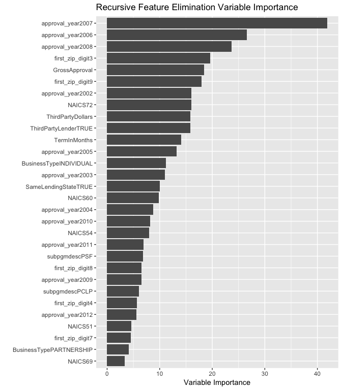
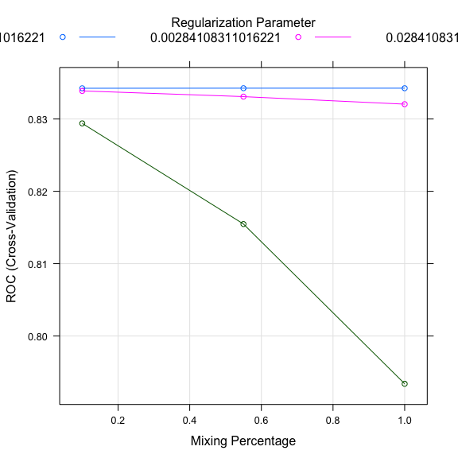
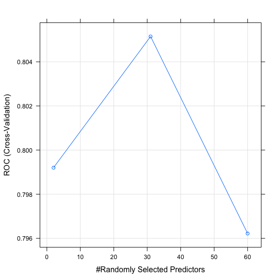
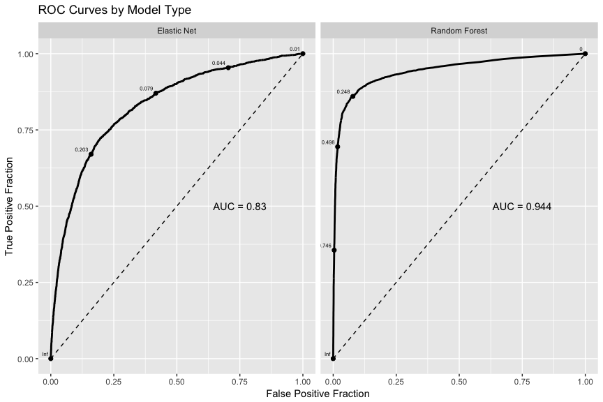
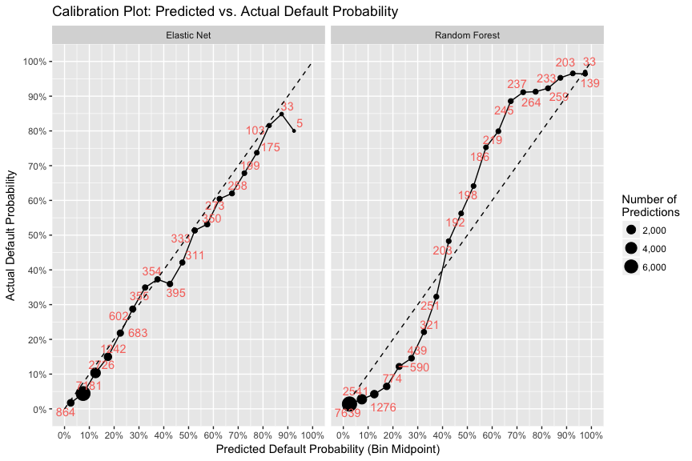

# MSE 246 Data Cleaning
Samuel Hansen  
1/21/2017  


#Overview

This script builds predictive models of small-business defaults using 
data spanning 1990-2014 provided by the Small Business Association (SBA). 
To do so, this script implements a pipeline that:

1. Performs feature engineering;
2. Splits the data into train and test sets;
3. Normalizes continuous features;
4. Selects features using recursive feature elimination;
5. Trains binary outcome predictive models, including LASSO and random 
forests. 

Lastly, we evaluate the performance of these models on the held-out test set
in terms of AUC, sensitivity, and calibration. 


```r
# Initialize libraries and input files 
library(ggrepel)
library(knitr)
library(lubridate)
library(caret)
library(stringr)
library(plotROC)
library(pROC)
library(tidyverse)
file_in <- "../data/SBA_Loan_data_2.csv"

# Read in data 
df <- 
  read_csv(file_in) %>%
  plyr::rename(replace = c("2DigitNAICS" = "NAICS")) %>%
  mutate(ApprovalDate = mdy(ApprovalDate))
```

#Feature Engineering

We engineered the following features from the raw data: 

- `first_zip_digit`: the first digit of the borrower's zip code;
- `2DigitNAICS`: the first two digits of the NAICS code;
- `subpgmdesc`: condensed infrequent factor levels into "other" category;
- `approval_year`: extracted year from loan approval datetime object;
- `term_divisibility`: encodes whether the loan term is divisible by 2. 


```r
df <- 
  df %>%
  mutate(
    # Extract first digit of zip code
    first_zip_digit = str_sub(BorrZip, end = 1), 
         
    # Encode rare subprograms as "Other"
    subpgmdesc = if_else(subpgmdesc == "Delta" | subpgmdesc == "Refinance",
                              "Other", subpgmdesc),
         
    # Extract approval year
    approval_year = year(ApprovalDate),
         
    # Encode whether loan term is even 
    term_divisibility = if_else(TermInMonths %% 2 == 0, "Even", "Odd"),
    
    # Encode Charge-off as "1"; otherwise as "0"
    LoanStatus = if_else(LoanStatus == "CHGOFF", "default", "paid")
    ) %>%
  
  # Convert features to factors 
  dmap_at(c("NAICS", "DeliveryMethod", "approval_year", "LoanStatus"), as.factor) %>%
  
  # Drop unneeded features
  select(-c(ApprovalDate, BorrZip, DeliveryMethod, ChargeOffDate, GrossChargeOffAmount))
```

#Data Splitting

We randomly partition the data into 70% training and 30% test sets. This
approach does not implement a time-based split, but rather a random sampling 
of observations over the entire 1990-2014 window. 


```r
# Split data into train and validation sets 
percent_in_train <- 0.7
train_indices <- sample(nrow(df), size = percent_in_train*nrow(df))
train <- df[train_indices, ]
test <- df[-train_indices, ]
```

#Data Preprocessing

Some variables are on different scales; for example, `Gross Approval` 
varies in dollar amounts from \$30,000  to \$4,000,000, whereas 
`Term in Months` ranges from 1 to 389. In turn, we center and scale the 
predictors to apply regularization techniques during the modeling phase. 

```r
# Define pre-processing steps to apply to training data
preProcessSteps <- c("center", "scale")

# Apply same pre-processing steps to the test set
preProcessObject <- preProcess(train, method = preProcessSteps)
train <- predict(preProcessObject, train)
test <- predict(preProcessObject, test)
```

#Feature Selection

We perform feature selection using recursive feature elimination
with 10-fold cross-validation. This method uses the 
`rfFuncs` parameter, which uses random forests to remove 
variables with low variable importance.

```r
# Set the recursive feature elimination parameters 
set.seed(1234)
rfFuncs$summary <- twoClassSummary
rfe.cntrl <- rfeControl(functions = rfFuncs,
                      method = "cv",
                      number = 5,
                      returnResamp = "final")
train.cntrl <- trainControl(selectionFunction = "oneSE",
                            classProbs = TRUE,
                            summaryFunction = twoClassSummary)

# Perform recursive feature elimination to select variables
rfe.results <-
  rfe(LoanStatus~.,
      data = train,
      rfeControl = rfe.cntrl,
      preProc = preProcessSteps,
      metric = "ROC",
      trControl = train.cntrl)
```


The following table shows that recursive feature selection 
chooses 60
variables to include in subsequent model building.

```r
print(rfe.results)
```

```
## 
## Recursive feature selection
## 
## Outer resampling method: Cross-Validated (5 fold) 
## 
## Resampling performance over subset size:
## 
##  Variables    ROC   Sens   Spec    ROCSD   SensSD   SpecSD Selected
##          4 0.6808 0.9431 0.4091 0.008976 0.001802 0.008720         
##          8 0.7273 0.9534 0.3621 0.028523 0.009528 0.035838         
##         16 0.7918 0.9578 0.3653 0.007996 0.002345 0.007991         
##         60 0.8219 0.9628 0.3607 0.005836 0.002881 0.005959        *
## 
## The top 5 variables (out of 60):
##    approval_year2007, approval_year2006, approval_year2008, first_zip_digit3, GrossApproval
```

The procedure selects 60 
variables because AUC is maximized (see plot below):

```r
ggplot(rfe.results) +
  labs(x = "Number of Variables",
       y = "AUC (Cross-Validated)",
       title = "Recursive Feature Elimination\nNumber of Variables vs. AUC")
```

<!-- -->

The importances of the top 30 selected features are given by:

```r
data_frame(predictor = rownames(varImp(rfe.results)), 
           var_imp = varImp(rfe.results)$Overall) %>%
  slice(1:30) %>%
  ggplot(mapping = aes(x = reorder(predictor, var_imp), y = var_imp)) +
  geom_bar(stat = "identity") +
  coord_flip() +
  labs(x = "", 
       y = "Variable Importance", 
       title = "Recursive Feature Elimination Variable Importance")
```

<!-- -->


```r
# Map factor levels back to their respective features 
(selected_vars <- map(predictors(rfe.results), ~str_match(.x, names(df))) %>% 
  unlist() %>% 
  .[!is.na(.)] %>%
  unique())
```

```
##  [1] "approval_year"              "first_zip_digit"           
##  [3] "GrossApproval"              "NAICS"                     
##  [5] "ThirdPartyDollars"          "ThirdPartyLender"          
##  [7] "TermInMonths"               "BusinessType"              
##  [9] "SameLendingState"           "subpgmdesc"                
## [11] "MultiTimeBorrower"          "DummyNAICS"                
## [13] "SameThirdPartyLendingState" "term_divisibility"
```

```r
train_selected_vars <- train %>%
  select(one_of(selected_vars), LoanStatus)
```


#Model Fitting 

Using these selected features, we fit models predicting the binary outcome
of whether a small busniess defaults on a loan. To tune hyperparameters,
we use 10-fold cross-validation with the one standard-error rule, which selects
parameters that obtain the highest cross-validated AUC within one standard error
of the maximum. 


```r
# Define cross-validation controls 
cvCtrl <- trainControl(method = "cv", 
                       number = 10,
                       summaryFunction = twoClassSummary, 
                       selectionFunction = "oneSE",
                       classProbs = TRUE)
```

##Elastic Net

We fit an elastic net model as follows:

```r
# Fit penalized logistic regression model (elastic net)
elastic.fit <- train(LoanStatus ~ .,
                   data = train_selected_vars,
                   preProc = preProcessSteps,
                   method = "glmnet",
                   family = "binomial",
                   trControl = cvCtrl,
                   metric = "ROC")
```

The elastic net model was selected with the following hyperparameters:

```
## glmnet 
## 
## 38364 samples
##    14 predictor
##     2 classes: 'default', 'paid' 
## 
## Pre-processing: centered (60), scaled (60) 
## Resampling: Cross-Validated (10 fold) 
## Summary of sample sizes: 34527, 34528, 34527, 34527, 34528, 34528, ... 
## Resampling results across tuning parameters:
## 
##   alpha  lambda        ROC        Sens        Spec     
##   0.10   0.0002841083  0.8342497  0.36266848  0.9554863
##   0.10   0.0028410831  0.8338825  0.35821342  0.9564838
##   0.10   0.0284108311  0.8293940  0.27944012  0.9701060
##   0.55   0.0002841083  0.8342606  0.36298695  0.9554863
##   0.55   0.0028410831  0.8330921  0.35391659  0.9571072
##   0.55   0.0284108311  0.8154765  0.19828360  0.9791771
##   1.00   0.0002841083  0.8342559  0.36298720  0.9555175
##   1.00   0.0028410831  0.8320455  0.34659428  0.9579177
##   1.00   0.0284108311  0.7933869  0.07606301  0.9941085
## 
## ROC was used to select the optimal model using  the one SE rule.
## The final values used for the model were alpha = 0.1 and lambda
##  = 0.002841083.
```

<!-- -->

##Random Forest

We fit a random forest model as follows:

```r
# Fit penalized logistic regression model (elastic net)
rf.fit <- train(LoanStatus ~ .,
                   data = train_selected_vars,
                   preProc = preProcessSteps,
                   method = "rf",
                   trControl = cvCtrl,
                   metric = "ROC")
```

The random forestmodel was selected with the following hyperparameters:

```
## Random Forest 
## 
## 38364 samples
##    14 predictor
##     2 classes: 'default', 'paid' 
## 
## Pre-processing: centered (60), scaled (60) 
## Resampling: Cross-Validated (10 fold) 
## Summary of sample sizes: 34527, 34528, 34528, 34528, 34528, 34528, ... 
## Resampling results across tuning parameters:
## 
##   mtry  ROC        Sens        Spec     
##    2    0.7992008  0.02211806  0.9990960
##   31    0.8051484  0.36728656  0.9415835
##   60    0.7962180  0.37317373  0.9321696
## 
## ROC was used to select the optimal model using  the one SE rule.
## The final value used for the model was mtry = 31.
```

<!-- -->

#Model Evaluation 

##ROC Plots 


```r
# Evaluate performance of trained models on test set 
testResults <- data.frame(true_value = test$LoanStatus)
testResults$randomForest <- predict(rf.fit, test, type = "prob")[,"default"]
testResults$elasticNet <- predict(elastic.fit, test, type = "prob")[,"default"]

# Compute AUC by model type 
aucs <-
  data_frame(randomForest = pROC::auc(roc(predictor = testResults$randomForest,
                       response = testResults$true_value)),
             elasticNet = pROC::auc(roc(predictor = testResults$elasticNet,
                       response = testResults$true_value))) %>%
  gather(method, auc_value, randomForest:elasticNet) %>%
  mutate(auc_label = paste("AUC =", round(auc_value,3)))

# Gather results in long format 
testResults <- 
  testResults %>%
  gather(method, predicted_prob, randomForest:elasticNet) %>%
  mutate(true_value = ifelse(true_value == "default", 1, 0))
```


```r
model_labels <- c("randomForest" = "Random Forest",
                  "elasticNet" = "Elastic Net")

# Plot ROC curves by model type 
testResults %>%
  ggplot(mapping = aes(d = true_value, m = predicted_prob)) +
  geom_roc(n.cuts = 5, labelsize = 2, labelround = 3) +
  annotate(geom = "segment", x = 0, xend = 1, y = 0, yend = 1,
           color = "black", linetype = 2) +
  labs(x = "False Positive Fraction", y = "True Positive Fraction",
       title = "ROC Curves by Model Type") +
  facet_wrap(~method, labeller = labeller(method = model_labels)) +
  geom_text(data = aucs, aes(x = 0.75, y = 0.5, label = auc_label), 
                    colour = "black", inherit.aes = FALSE, parse = FALSE)
```

<!-- -->

##Calibration Plots 


```r
# Make calibration plots, facetted by model type
pred_prob_midpoints <- data_frame(midpoint = rep(seq(0.025, 0.975, 0.05), each = 2))
testResults %>%
  mutate(prob_bin = cut_width(predicted_prob,width = 0.05)) %>%
  group_by(prob_bin, method) %>%
  summarise(prob_default = mean(true_value, na.rm = TRUE),
            n = n()) %>%
  bind_cols(., pred_prob_midpoints) %>%
  ungroup() %>%
  ggplot(mapping = aes(x = midpoint, y = prob_default, label = n)) +
  geom_line() +
  geom_point(mapping = aes(size = n)) +
  geom_text_repel(mapping = aes(color = "red")) +
  annotate(geom = "segment", x = 0, xend = 1, y = 0, yend = 1,
           color = "black", linetype = 2) +
  scale_x_continuous(labels = scales::percent,
                     breaks = seq(0, 1, by = 0.1)) +
  scale_y_continuous(labels = scales::percent,
                     breaks = seq(0, 1, by = 0.1)) +
  scale_colour_discrete(guide = FALSE) +
  scale_size(name = "Number of\nPredictions",
             labels = scales::comma) +
  labs(x = "Predicted Default Probability (Bin Midpoint)",
       y = "Actual Default Probability",
       title = "Calibration Plot: Predicted vs. Actual Default Probability") +
  # facet_wrap(~method)
  facet_wrap(~method, labeller = labeller(method = model_labels))
```

<!-- -->


